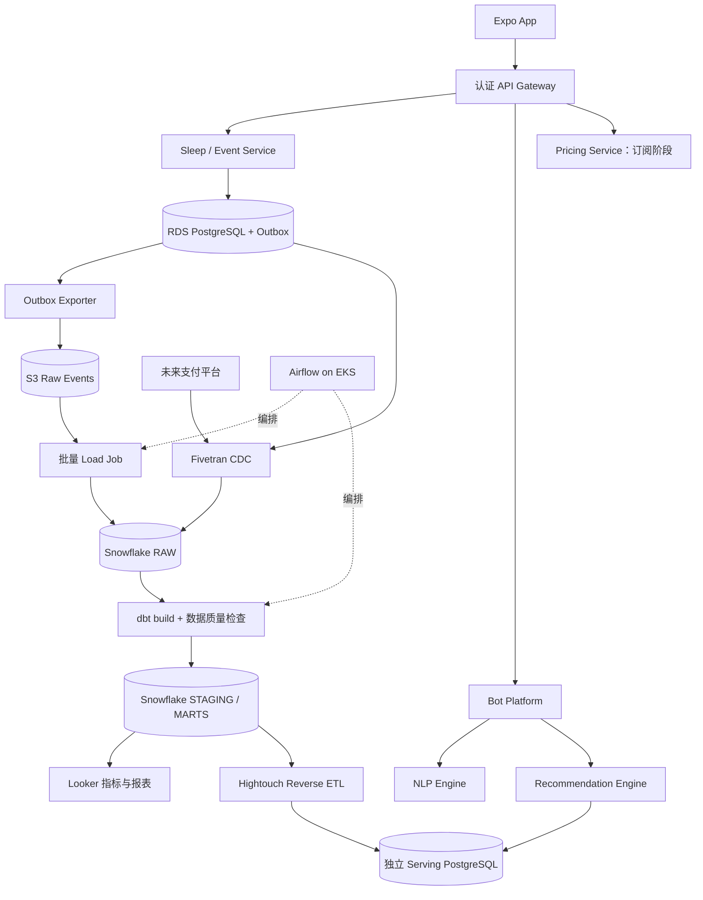

# SleepTracker：数据工程与服务架构方案

状态：云端目标架构尚未部署。已实现 [本地 ELT MVP](../data-platform/README.md) 和 [App 上传队列 → 认证采集 API → PostgreSQL](../server/INGESTION.md)，后者已用真实 PostgreSQL 做集成验证。S3／数据仓库／云端编排仍待接入。

## 1. 现状与目标

现有 Expo 应用通过 `services/sleepSessionPersistence.ts` 将历史和上传队列一起存入 AsyncStorage 的 `sleepJournal.v1`；`server/ingestion.mjs` 提供 `POST /v1/events`，通过服务端签发凭证确定 user_id，并事务写入 PostgreSQL 与 outbox。`services/dailyRecommendation.ts` 调用推荐 API 并支持本地回退。`server/index.mjs` 是 Node 推荐网关，`sleep-tracker/src/index.js` 是另一个 Workers 实现。采集服务暂独立部署，推荐网关保持原入口。现有 Python 分析脚本使用研究 CSV，独立于产品事件。

目标是建立“睡眠记录 → 可追溯指标 → 推荐特征 → 用户反馈”的闭环，并支持服务独立部署。微服务数量不是验收指标；数据正确性、可重放性、接口边界和运行证据才是。

## 2. 目标架构

图中 S3 和 Fivetran 是不同来源的装载路径：睡眠事件先选 S3 批量链路；Fivetran 用于用户业务表或支付来源，避免同一事件被重复装载。Serving 数据库与采集源分开，避免 reverse ETL 写回形成循环。

## 3. 服务边界

| 服务 | SleepTracker 中的职责 | 接口与状态 |
| --- | --- | --- |
| Sleep / Event | 持久化睡眠记录和事务 outbox，验证事件版本与幂等键 | 已实现 `POST /v1/events`、`GET /v1/me`；本地 PostgreSQL 集成验证通过 |
| Bot Platform | 管理对话会话、路由意图、组合推荐响应 | 计划 `POST /v1/chat`；不直接访问仓库 |
| NLP Engine | 将用户文本转换为意图、语言、主题，输出模型版本 | 计划内部 `POST /v1/analyze`；分类失败返回 unknown |
| Recommendation Engine | 组合近期睡眠、已发布特征和现有推荐逻辑 | 沿用 `POST /v1/recommendations`；保持移动端响应契约 |
| Pricing | 管理套餐、地区/币种价格和实验版本 | 未来 `GET /v1/plans`；需先有订阅业务，金额使用整数最小货币单位 |

Bot 和 NLP 首先验证独立接口，再在确有独立扩容或发布需求时拆为部署单元。Pricing 展示正常的套餐实验，不基于健康状况调整个人价格。实际收费由支付平台决定，客户端报价不作为结算依据。

同步请求走服务 API；分析事件异步写出，不让仓库故障阻塞推荐。每个服务只写自己拥有的表，携带 request_id、超时和版本信息；重试必须配合幂等键。

## 4. 数据栈职责

| 工具 | 负责什么 | 接入前提与验收 |
| --- | --- | --- |
| Airflow | 依赖、调度、重试、补数及失败告警 | DAG 按数据区间处理；补跑同一区间结果一致 |
| Fivetran | 业务数据库/支付数据的托管同步 | 来源权限、目标账号和同步水位；等待实际同步成功再消费 |
| Snowflake | RAW、STAGING、MARTS 分层及计算隔离 | 角色隔离、装载清单、批次 ID、成本监控 |
| dbt | SQL 模型、依赖图、数据测试和文档 | 唯一性、非空、关联完整性、合法时长；`dbt build` 通过才发布 |
| Looker | 统一指标与可视化 | 连接 MARTS，LookML 固定粒度和分母；用户级权限 |
| Hightouch | 将精选特征同步到推荐服务的 serving store | user_id 主键、删除传播、同步水位、失败重试和字段白名单 |
| AWS / Kubernetes | 托管自有服务和分布式任务 | EKS、RDS、S3、ECR、Secrets Manager 和可观测性 |

Fivetran、Snowflake、Looker、Hightouch 按托管平台接入，不放进 EKS。Airflow 的 KubernetesExecutor 可让任务运行在独立 Pod；它本身不负责把 SQL 转换成分布式计算，转换计算由 Snowflake 执行。[Airflow 官方说明](https://airflow.apache.org/docs/apache-airflow-providers-cncf-kubernetes/stable/kubernetes_executor.html)、[Amazon EKS](https://docs.aws.amazon.com/eks/latest/userguide/what-is-eks.html)。

集成依据：[Fivetran → Snowflake](https://fivetran.com/docs/destinations/snowflake)、[dbt 与 Snowflake](https://docs.snowflake.com/en/user-guide/data-engineering/dbt-projects-on-snowflake)、[Looker → Snowflake](https://docs.cloud.google.com/looker/docs/db-config-snowflake)、[Hightouch destinations](https://hightouch.com/docs/destinations/overview)。具体套餐、连接器和权限需在接入时验证。

## 5. 数据建模与质量

- `raw_sleep_events`：版本化事件、event_id、生产时间、接收时间、批次和来源。原始层可重放。
- `stg_sleep_sessions`：一行一个已验证会话；明确小时单位、UTC 标准时间和事件去重规则。
- `fct_sleep_daily`：一行一个用户和睡眠日；会话数、总时长。MVP 按 UTC 结束日，后续增加 IANA 时区与本地睡眠日。
- `fct_recommendation_events`：一行一次生成/展示/反馈事件；recommendation_id、source、模型/提示词版本、耗时和反馈类型。展示和反馈事件需新增客户端埋点。
- `mart_recommendation_features`：最近 7 天统计、有效样本数、features_as_of、feature_version。历史评估严格按当时可见数据生成，防止未来数据泄漏。
- 订阅出现后增加 `fct_subscription_events` 和 `mart_subscription_daily`。现阶段无法计算真实营收或价格实验效果。

定义推荐反馈率时，以同一观察窗口内“有反馈的已展示推荐数 / 已展示推荐数”为口径；区分生成成功率和展示率。留存需要真实用户标识、注册/首次活跃时间和产品事件，不能从研究 CSV 推导。

生产数据质量闸门：event_id 唯一、用户引用有效、时长合法、分区行数异常告警、source freshness 和 watermark 检查。坏数据进入隔离层，修复后可重放；通过测试的批次才切换发布版本。dbt/Hightouch 失败时继续使用上一版特征，超过配置的 freshness 阈值则使用现有本地回退。批次原子发布避免读到部分结果。

## 6. AWS / EKS 实施边界

服务与 Airflow 部署到 EKS；工作节点、RDS 放在私有网络，网关通过认证和 TLS 暴露。镜像放 ECR，任务数据和日志放 S3，凭证通过 Secrets Manager 与工作负载身份提供，设置请求/限制、readiness/liveness 和 NetworkPolicy。Airflow 元数据库使用独立 PostgreSQL 数据库，不使用 SQLite。

分布式任务之间通过 S3 对象地址、manifest 和 Snowflake 表传递数据，禁止依赖前一个 Pod 的本地文件。任务按 UTC 区间分区，manifest 记录校验和与装载状态；重试通过批次和 event_id 去重，失败任务不会推进水位。跨日迟到数据重算受影响分区；并发补数需分区锁或互斥策略。

手机采集需要认证用户、用户授权开关、持久化离线 outbox 和服务端确认。服务端从身份凭证确定 user_id。删除请求要传播到 raw、仓库、serving 和下游同步目标，保留期限和备份删除策略在真实数据接入前确定。聊天正文与个人健康档案默认不进入分析事件。

## 7. 分阶段交付与验收

| 阶段 | 产物 | 完成标准 |
| --- | --- | --- |
| 0：已实现 | Python / SQLite 本地 ELT、合成事件和测试 | 重跑去重、迟到数据汇总、坏数据隔离、冲突 ID 与时区测试 |
| 1：产品采集（已实现并本地验证） | Events API、PostgreSQL outbox、手机上传队列、个人连接凭证 | 离线恢复、重复提交、鉴权隔离、事务失败后重试测试通过；真机及云端部署仍待验证 |
| 2：仓库 | S3 load、Snowflake schemas、dbt 模型与 Airflow DAG | 一次完整装载、失败重试、历史补数、dbt 测试和运行记录 |
| 3：消费闭环 | LookML、Hightouch 同步、推荐特征读取 | 仓库与展示指标一致，特征可追溯，过期回退与删除传播测试 |
| 4：服务与云 | Bot/NLP、EKS 基础设施代码、CI/CD | 独立构建/部署，服务故障不破坏睡眠记录，告警及恢复演练 |
| 5：商业化 | 支付来源 Fivetran、Pricing 与订阅 marts | 支付事件对账、幂等结算事件、套餐实验口径验证 |

本轮不创建云资源或付费连接。阶段 2 起需要用户的开发环境账号、选定 AWS region、预算和部署目标。履历或项目介绍应按真实交付描述：当前可写“实现可重放的本地 ELT 原型，设计 AWS/EKS 与现代数据栈扩展方案”；尚不能写“已运营分布式云端微服务数据平台”。
